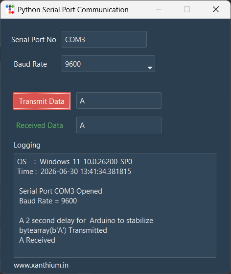
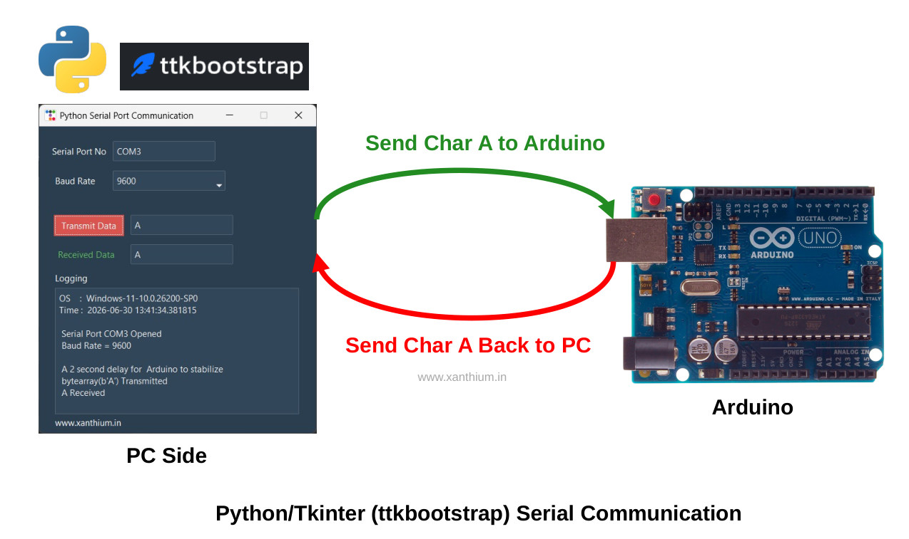
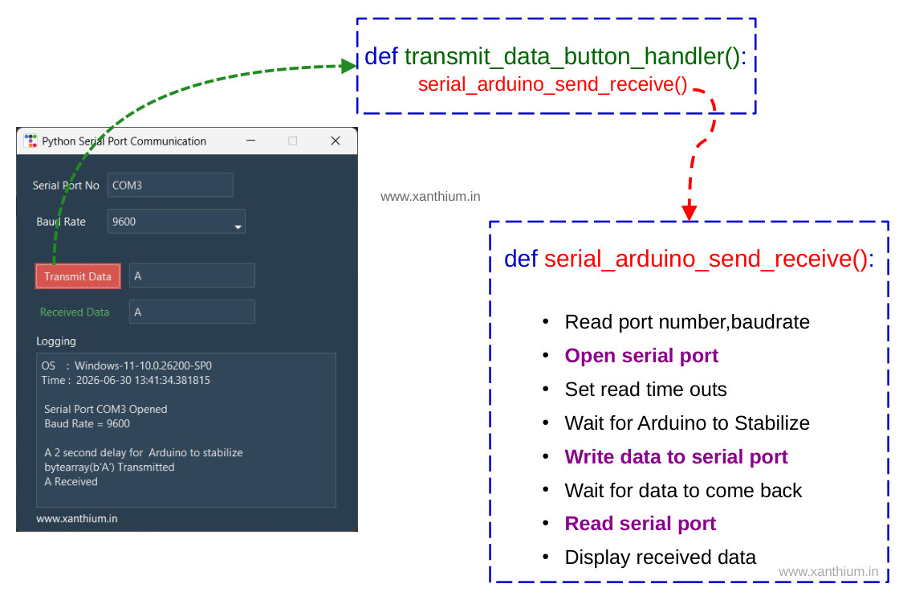

# GUI based Python tkinter(ttkbootstrap) serial port communication Program with Arduino

 - 

 - A cross-platform Python GUI application for communicating with Arduino,microcontrollers (ATmega328P,RP2040,RP2350),and other UART-based embedded systems over a serial port using PySerial and tkinter (ttkbootstrap).

- The application provides a modern graphical interface for opening a serial port, transmitting data to a connected device, receiving responses, and displaying the communication log in real time.

- It is designed as a **beginner-friendly** project for learning both Python GUI programming and serial communication.

## Features
- Modern GUI built using Tkinter and ttkbootstrap
- Cross-platform support (Windows, Linux, and macOS)
- Send ASCII characters or text to an Arduino or any UART-enabled device
- Receive serial data and display it in a scrolling log window
- Simple and easy-to-understand source code
- MIT licensed source code suitable for both personal and commercial projects

 ## Website/Tutorial

 - A detailed explanation of the project, including the GUI design, PySerial programming, and Arduino communication, is available in the accompanying tutorial (below)

  - [How to create GUI serial port communication program with arduino and PC using Python and tkinter(ttkbootstrap)](https://www.xanthium.in/simple-gui-based-python-tkinter-ttkbootstrap-serialport-communication-arduino-uart-microcontroller)

## Hardware Connections 

- 

## Software Architecture

- 

## References

- [Python tkinter GUI Programming for Absolute Beginner](https://www.xanthium.in/short-concise-tutorial-python-gui-design-using-tkinter-ttkbootstrap-beginners)
- [Cross Platform serial communication using Python (PySerial) and Arduino](https://www.xanthium.in/Cross-Platform-serial-communication-using-Python-and-PySerial)
- [Serial communication using Python (PySerial) and Arduino/AVR/PIC Micro on Linux](https://www.xanthium.in/linux-serial-port-programming-using-python-pyserial-and-arduino-avr-pic-microcontroller)
- [Running Periodic background tasks in tkinter (ttkbootstrap) using .after() method](https://www.xanthium.in/running-periodic-background-tasks-in-python-tkinter-ttkbootstrap-using-after-method)
- [Creating and Sharing data between Python threads for the Absolute Beginner](https://www.xanthium.in/creating-threads-sharing-synchronizing-data-using-queue-lock-semaphore-python)
 